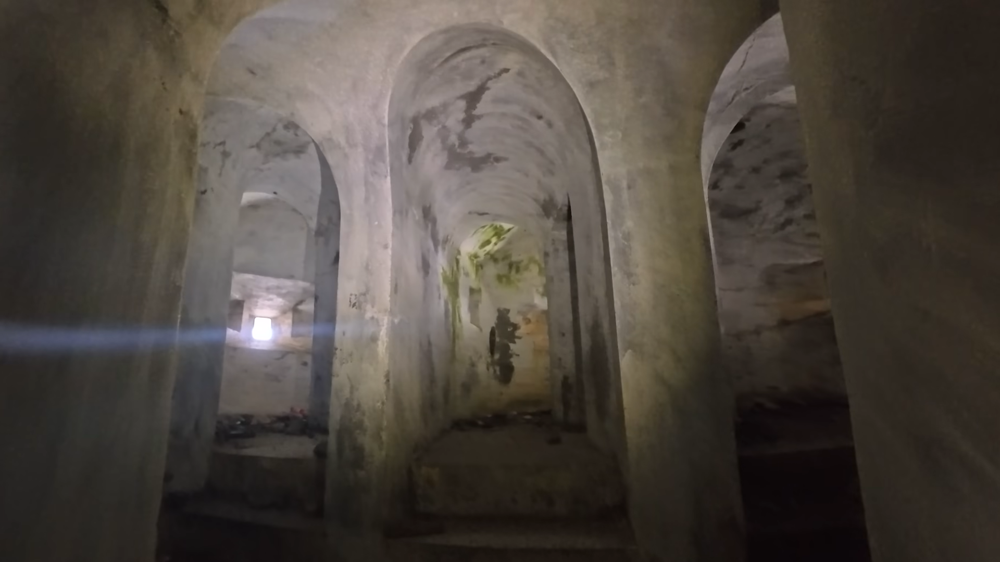

# Hiking

## Description

While on Google Earth, I discovered something very unusual: a strange white structure sat on the summit of an isolated mountain. It looks man-made.

Curiosity led me there, but I found even another one along the way. Now I’m stuck inside, and this live image is my only clue. Can you locate me?

- **Task:** Submit the latitude and longitude in decimal degrees, rounded to 3 decimal places.
- **Flag format:** `CATF{LAT,LON}`
- **Example:** `CATF{30.030,31.460}`

---

## solver summary

### discovery

- **Tech Stack:**
    1. Google Earth / Satellite Imagery
    2.

- **Endpoints:**
    1.
    2.

- **Vulnerabilities:**
    1.
    2.

### PoC/Exploitation

1.
2.

### flag

- `CATF{...}`
