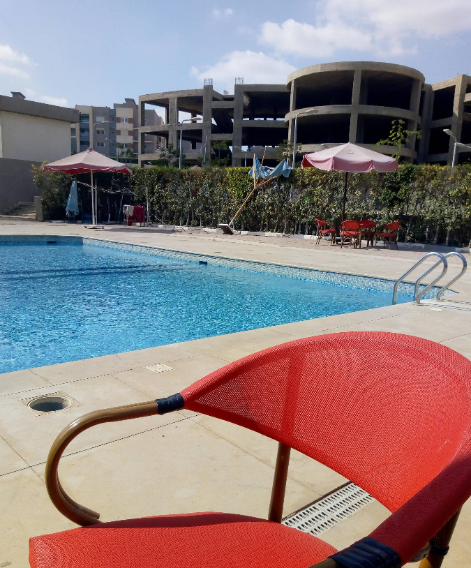

# Pool Party

## Description

It was a really hot Friday, and we just wanted to go for a swim. We drove to the sports club, but security stopped us at the gate, our friend was not a member, and they strictly do not allow guests.

While we were stuck outside, another friend called and told us to just come over to his compound right next to the club. We spent the rest of the day chilling by the water, might not be the best pool, but the Red chairs reminded us of the other pool .

Trace our steps, inspect the evidence, and find the exact name of the pool on google maps.

**Flag Format**:`CATF{<Exact_Location_Name_On_Google_Maps_Underscore_instead_of_spaces>} (e.g., CATF{National_Minya_Pool}`

---

## solver summary

### discovery

- **Tech Stack:**
    1.
    2.

- **Endpoints:**
    1.
    2.

- **Vulnerabilities:**
    1.
    2.

### PoC/Exploitation

1.
2.

### flag

- `CTF{...}`
