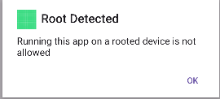

# root detection bypass

when running the app we see the following message




to bypass it : unpack the app with apktools

```bash
apktool d Androbro.apk --use-aapt2
```

go to com/defensys/MainActivity and change the samli code if isRooted to 

```
.method public static isRooted()Z
    .locals 6

    const/4 v0, 0x0

    return v0
.end method
```

# unlock the TRIGER

analyzing the native library `ragnar` we have to :
....
.
.
...


to get the flag do 

```bash
adb shell am broadcast -a THE_TRIGER
```

```bash
adb shell am broadcast -a THE_UNLOCKER --es key 6a209693a9acaf10dcd2e425bab62a5e48698b7fc3
```

click on the `check` button in the app

```
frida-dexdump -U -f com.defensys.androbro
```

decompile the dex
```java
public class FlagChecker {
    private static final String BASE64_ENCRYPTED_FLAG = "LbkzN+Zr+k6klBtEh0jWnGX6zjTPXXTCztliM8++ENqdkWdyT5nkPn3yQ2YCXh9oBpvd9ab7AKS2JJ2i5YBj+Q==";
    private static final String BASE64_IV = "Z4drGE7JIeRhwjFxxw4kcA==";
    private static final String BASE64_KEY = "QZrwuDw4+lFrKFRvznVl3A==";

    private static String decryptFlag() {
        try {
            byte[] decode = Base64.decode(BASE64_KEY, 0);
            byte[] decode2 = Base64.decode(BASE64_IV, 0);
            byte[] decode3 = Base64.decode(BASE64_ENCRYPTED_FLAG, 0);
            Cipher cipher = Cipher.getInstance("AES/CBC/PKCS5Padding");
            cipher.init(2, new SecretKeySpec(decode, "AES"), new IvParameterSpec(decode2));
            return new String(cipher.doFinal(decode3), StandardCharsets.UTF_8);
        } catch (Exception e) {
            e.printStackTrace();
            return null;
        }
    }

    public static boolean checkFlag(String str) {
        String decryptFlag = decryptFlag();
        return decryptFlag != null && decryptFlag.equals(str);
    }
}
```

decrypting the flag gives us : `L3AK{_Using_native_cpp__is_not_really_hard_xd_31412314}`