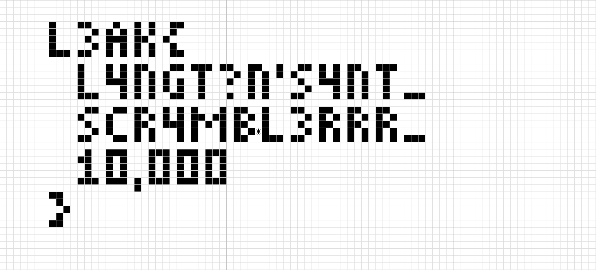

# Subleq Scramble

- **Author:** Shatterbox
- **Category:** Reverse
- **Solves:** 77

## Description

Some dude's been trying to hide even more secrets behind yet another one of his "all-new, totally one-of-a-kind encryption algorithms" that he'd been yapping about.

Apparently it's some sort of "subleq emulator" that runs thousands of iterations of an image encryption algorithm... before straight-up memdumping the entire program state into a binary file when it's done.

All of it.

Given that he was kind enough to send us an encrypted file, that probably means the algorithm's open-source now.

Nobody tell him.

Note: Flag format is /L3AK{[A-Z0-9?'_,]+}/

---

## Solution

`data.subleq` is a memdump of a 16-bit Subleq program that had simulated Langton's Ant (a reversible Cellular Automaton) on an 84 by 38 binary grid of cells for exactly 9999 ticks.

The program can actually be rerun and continued from this point forward, as it refreshes the 9999 tick countdown when it's run from instruction 0. Using dynamic analysis and you should be able to pinpoint every access to the binary data at the end of the program, which follows a pattern where it always flips a bit then accesses the next one +-1 or +-84 ints away.

One can then visualize this grid and notice the exact pattern following Langton's Ant rules. With one ant, these rules are actually fully reversible. You could extract the memory and the position and direction of the ant and write your own reverser algorithm, but a simpler, cooler method is turning the ant around and placing it 1 step forward in the new direction. This makes the simulator reverse itself. This is the method used in solve.py.

After 9999 reverse iterations, it automatically stops, having fully unscrambled the flag. The whole 84 by 38 grid is ready to be viewed.

# Flag

The final grid shows the flag drawn in pixelated font. All one has to do is remove the whitespace.

Here's the final grid as seen in Golly, the simulator used to experiment with different grid setups:



Flag visualized as ASCII art (zoom out):

# Run solver script

```sh
# assume in subleq-scramble folder
python3 solution/solve.py dist/data.subleq
```

This takes between 1-2 seconds on my machine before outputting this:

```
. . . . . . . . . . . . . . . . . . . . . . . . . . . . . . . . . . . . . . . . . . . . . . . . . . . . . . . . . . . . . . . . . . . . . . . . . . . . . . . . . . . .
. . . . . . . . . . . . . . . . . . . . . . . . . . . . . . . . . . . . . . . . . . . . . . . . . . . . . . . . . . . . . . . . . . . . . . . . . . . . . . . . . . . .
. . . . . . . . . . . . . . . . . . . . . . . . . . . . . . . . . . . . . . . . . . . . . . . . . . . . . . . . . . . . . . . . . . . . . . . . . . . . . . . . . . . .
. . . . . . . []. . . [][]. . . []. . []. []. . [][]. . . . . . . . . . . . . . . . . . . . . . . . . . . . . . . . . . . . . . . . . . . . . . . . . . . . . . . . . .
. . . . . . . []. . . . . []. []. []. []. []. . []. . . . . . . . . . . . . . . . . . . . . . . . . . . . . . . . . . . . . . . . . . . . . . . . . . . . . . . . . . .
. . . . . . . []. . . . []. . [][][]. [][]. . []. . . . . . . . . . . . . . . . . . . . . . . . . . . . . . . . . . . . . . . . . . . . . . . . . . . . . . . . . . . .
. . . . . . . []. . . . . []. []. []. []. []. . []. . . . . . . . . . . . . . . . . . . . . . . . . . . . . . . . . . . . . . . . . . . . . . . . . . . . . . . . . . .
. . . . . . . [][][]. [][]. . []. []. []. []. . [][]. . . . . . . . . . . . . . . . . . . . . . . . . . . . . . . . . . . . . . . . . . . . . . . . . . . . . . . . . .
. . . . . . . . . . . . . . . . . . . . . . . . . . . . . . . . . . . . . . . . . . . . . . . . . . . . . . . . . . . . . . . . . . . . . . . . . . . . . . . . . . . .
. . . . . . . . . . . []. . . []. []. [][]. . . [][]. [][][]. [][]. . [][]. . []. . [][]. []. []. [][]. . [][][]. . . . . . . . . . . . . . . . . . . . . . . . . . . .
. . . . . . . . . . . []. . . []. []. []. []. []. . . . []. . . . []. []. []. []. []. . . []. []. []. []. . []. . . . . . . . . . . . . . . . . . . . . . . . . . . . .
. . . . . . . . . . . []. . . [][][]. []. []. []. []. . []. . . []. . []. []. . . . []. . [][][]. []. []. . []. . . . . . . . . . . . . . . . . . . . . . . . . . . . .
. . . . . . . . . . . []. . . . . []. []. []. []. []. . []. . . . . . []. []. . . . . []. . . []. []. []. . []. . . . . . . . . . . . . . . . . . . . . . . . . . . . .
. . . . . . . . . . . [][][]. . . []. []. []. . [][]. . []. . . []. . []. []. . . [][]. . . . []. []. []. . []. . [][][]. . . . . . . . . . . . . . . . . . . . . . . .
. . . . . . . . . . . . . . . . . . . . . . . . . . . . . . . . . . . . . . . . . . . . . . . . . . . . . . . . . . . . . . . . . . . . . . . . . . . . . . . . . . . .
. . . . . . . . . . . . [][]. . [][]. [][]. . []. []. []. . . []. [][]. . []. . . [][]. . [][]. . [][]. . [][]. . . . . . . . . . . . . . . . . . . . . . . . . . . . .
. . . . . . . . . . . []. . . []. . . []. []. []. []. [][]. [][]. []. []. []. . . . . []. []. []. []. []. []. []. . . . . . . . . . . . . . . . . . . . . . . . . . . .
. . . . . . . . . . . . []. . []. . . [][]. . [][][]. []. []. []. [][]. . []. . . . []. . [][]. . [][]. . [][]. . . . . . . . . . . . . . . . . . . . . . . . . . . . .
. . . . . . . . . . . . . []. []. . . []. []. . . []. []. . . []. []. []. []. . . . . []. []. []. []. []. []. []. . . . . . . . . . . . . . . . . . . . . . . . . . . .
. . . . . . . . . . . [][]. . . [][]. []. []. . . []. []. . . []. [][]. . [][][]. [][]. . []. []. []. []. []. []. [][][]. . . . . . . . . . . . . . . . . . . . . . . .
. . . . . . . . . . . . . . . . . . . . . . . . . . . . . . . . . . . . . . . . . . . . . . . . . . . . . . . . . . . . . . . . . . . . . . . . . . . . . . . . . . . .
. . . . . . . . . . . . []. . [][][]. . . [][][]. [][][]. [][][]. . . . . . . . . . . . . . . . . . . . . . . . . . . . . . . . . . . . . . . . . . . . . . . . . . . .
. . . . . . . . . . . [][]. . []. []. . . []. []. []. []. []. []. . . . . . . . . . . . . . . . . . . . . . . . . . . . . . . . . . . . . . . . . . . . . . . . . . . .
. . . . . . . . . . . . []. . []. []. . . []. []. []. []. []. []. . . . . . . . . . . . . . . . . . . . . . . . . . . . . . . . . . . . . . . . . . . . . . . . . . . .
. . . . . . . . . . . . []. . []. []. . . []. []. []. []. []. []. . . . . . . . . . . . . . . . . . . . . . . . . . . . . . . . . . . . . . . . . . . . . . . . . . . .
. . . . . . . . . . . [][][]. [][][]. []. [][][]. [][][]. [][][]. . . . . . . . . . . . . . . . . . . . . . . . . . . . . . . . . . . . . . . . . . . . . . . . . . . .
. . . . . . . . . . . . . . . . . . . []. . . . . . . . . . . . . . . . . . . . . . . . . . . . . . . . . . . . . . . . . . . . . . . . . . . . . . . . . . . . . . . .
. . . . . . . [][]. . . . . . . . . . . . . . . . . . . . . . . . . . . . . . . . . . . . . . . . . . . . . . . . . . . . . . . . . . . . . . . . . . . . . . . . . . .
. . . . . . . . []. . . . . . . . . . . . . . . . . . . . . . . . . . . . . . . . . . . . . . . . . . . . . . . . . . . . . . . . . . . . . . . . . . . . . . . . . . .
. . . . . . . . . []. . . . . . . . . . . . . . . . . . . . . . . . . . . . . . . . . . . . . . . . . . . . . . . . . . . . . . . . . . . . . . . . . . . . . . . . . .
. . . . . . . . []. . . . . . . . . . . . . . . . . . . . . . . . . . . . . . . . . . . . . . . . . . . . . . . . . . . . . . . . . . . . . . . . . . . . . . . . . . .
. . . . . . . [][]. . . . . . . . . . . . . . . . . . . . . . . . . . . . . . . . . . . . . . . . . . . . . . . . . . . . . . . . . . . . . . . . . . . . . . . . . . .
. . . . . . . . . . . . . . . . . . . . . . . . . . . . . . . . . . . . . . . . . . . . . . . . . . . . . . . . . . . . . . . . . . . . . . . . . . . . . . . . . . . .
. . . . . . . . . . . . . . . . . . . . . . . . . . . . . . . . . . . . . . . . . . . . . . . . . . . . . . . . . . . . . . . . . . . . . . . . . . . . . . . . . . . .
. . . . . . . . . . . . . . . . . . . . . . . . . . . . . . . . . . . . . . . . . . . . . . . . . . . . . . . . . . . . . . . . . . . . . . . . . . . . . . . . . . . .
. . . . . . . . . . . . . . . . . . . . . . . . . . . . . . . . . . . . . . . . . . . . . . . . . . . . . . . . . . . . . . . . . . . . . . . . . . . . . . . . . . . .
. . . . . . . . . . . . . . . . . . . . . . . . . . . . . . . . . . . . . . . . . . . . . . . . . . . . . . . . . . . . . . . . . . . . . . . . . . . . . . . . . . . .
. . . . . . . . . . . . . . . . . . . . . . . . . . . . . . . . . . . . . . . . . . . . . . . . . . . . . . . . . . . . . . . . . . . . . . . . . . . . . . . . . . . .
```

Flag text:

```
L3AK{L4NGT?N'S4NT_SCR4MBL3RRR_10,000}
```
