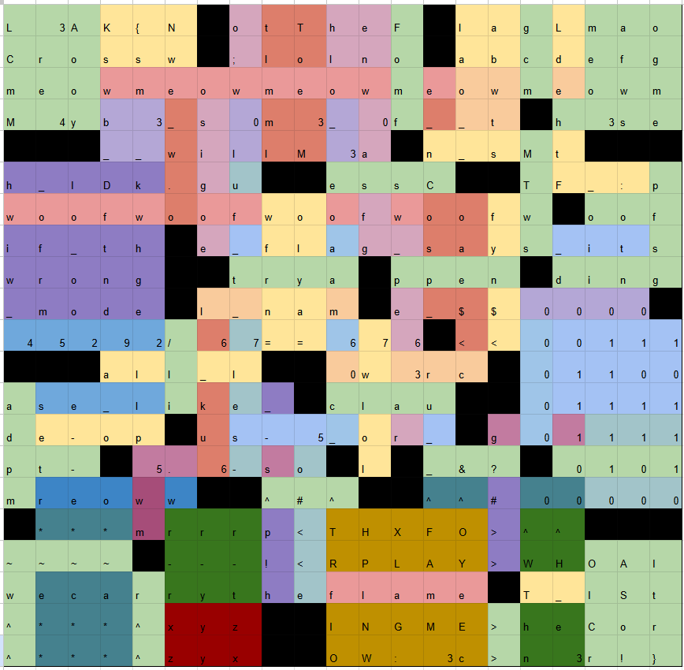

# hashword

- **Author:** sy1vi3
- **Category:** Reverse
- **Solves:** 1

## Description

the thing that bothers me about crossword puzzles is that you gotta know stuff in order to solve them

---

## Solution

You can solve it by brute-forcing 4 chars at a time, and then making two obvious inferences.

The cells here are color-coded by which order my solve path fills them in

It uses a modified sha256 algorithm looped ~100k times, this is tuned so a 4-char brute force should take ~2 minutes per 4-char brute on a half-decent gpu with a sanely-chosen charset
